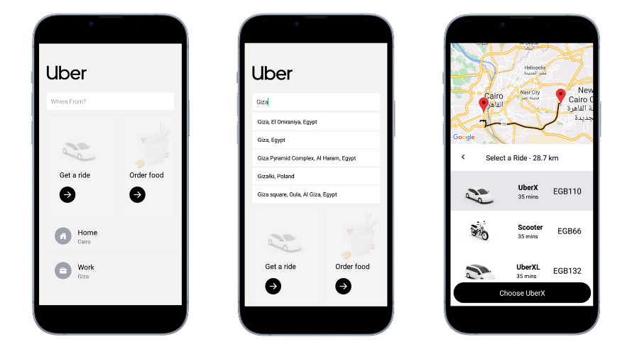

# Uber Clone App

This is a React Native(Expo) app that serves as an Uber clone, allowing users to search for locations using Google Places Autocomplete API, and displaying the direction on a map. The app utilizes Redux for state management, Tailwind for styling, and the Google Maps API for map functionality.

## Screenshots



## Features

- Search for locations using Google Places Autocomplete API.
- Display the direction between the selected origin and destination on a map.
- Utilize Redux for efficient state management.
- Apply Tailwind CSS for easy and responsive styling.
- Interact with the Google Maps API for map functionality.

## Technologies Used

- React Native - JavaScript framework for building native mobile apps.
- Redux - State management library for predictable state updates.
- Tailwind CSS - Utility-first CSS framework for rapid UI development.
- Google Maps API - Provides access to Google Maps services and functionality.

## Prerequisites

Before running the app, make sure you have the following:

- Node.js and npm installed on your machine.
- Google Maps API key. (Instructions on obtaining an API key can be found in the Google Maps API documentation.)

## Getting Started

1. Clone the repository:

```
git clone https://github.com/Ahmad-AlaaEdin/Uber-Clone.git
```

2. Navigate to the project directory:

```
cd Uber-Clone
```

3. Install the dependencies:

```
npm install
```

4. Create a `.env` file in the project root directory and add your Google Maps API key:

```
GOOGLE_MAPS_API_KEY=your-api-key
```

5. Start the app:

```
npx expo start
```
